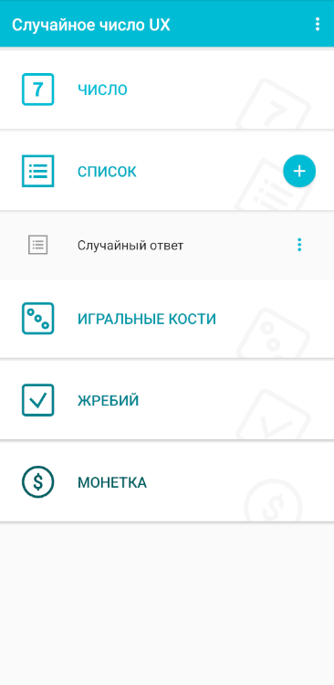

# Random-dice-application
# Мобильное приложение: [generator.apk](src/test/resources/generator.apk)

* Java Amazon Corretto version 17.0.12
* Junit 5
* Java-client version: 9.3.0
* Appium version 2.12.1
* UiAutomator2 version 3.8.1
* Allure-report version 2.24.0
* Emulator Pixel 7 API 35 (system language Russian)

## *Ключевые проверки для smoke-тестирования:*
1. Проверка всех названий кнопок на первом экране
2. Проверка переходов на соответствующие экраны через кнопки
3. Проверка выдачи корректных результатов в заданном диапазоне

* ### *Формирование allure-отчета* - build/reports/tests/test/index.html
* ### *Прогон занимает не более трех минут (с учетом Menu Button)*

  

